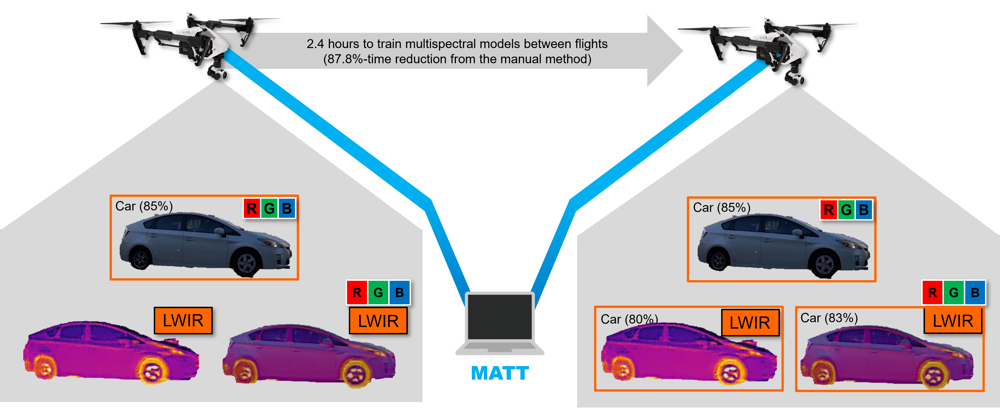

# Multispectral Automated Transfer Technique (MATT)

Segment Anything Model (SAM) is drastically accelerating the speed and accuracy of automatically segmenting and labeling large Red-Green-Blue (RGB) imagery datasets. However, SAM is unable to segment and label images outside of the visible light spectrum, for example, for multispectral or hyperspectral imagery. Therefore, this paper outlines a method we call the Multispectral Automated Transfer Technique (MATT). By transposing SAM segmentation masks from RGB images we can automatically segment and label multispectral imagery with high precision and efficiency. For example, the results demonstrate that segmenting and labeling a 2,400-image dataset utilizing MATT achieves a time reduction of 87.8% in developing a trained model, reducing roughly 20 hours of manual labeling, to only 2.4 hours. This efficiency gain is associated with only a 6.7% decrease in overall mean average precision (mAP) when training multispectral models via MATT, compared to a manually labeled dataset. We consider this an acceptable level of precision loss when considering the time saved during training, especially for rapidly prototyping experimental modeling methods. This research greatly contributes to the study of multispectral object detection by providing a novel and open-source method to rapidly segment, label, and train multispectral object detection models with minimal human interaction. Future research needs to focus on applying these methods to (i) space-based multispectral, and (ii) drone-based hyperspectral imagery.  

MATT utilizes an RGB segmentation mask from SAM and transposes the edge outline onto paired multispectral imagery [14]. The labels are automatically generated by Autodistill using basic ontology. Figure 2 illustrates the proposed solution using drone-based imagery. Using MATT, large multispectral datasets can be rapidly created with consistent label and segmentation performance to train object detection models.

